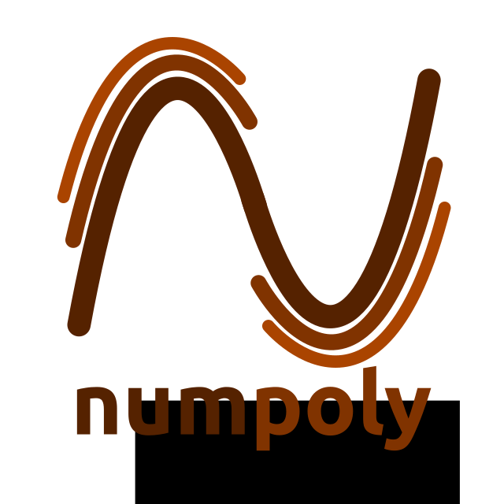

.. _about_us:

About us
========

Numpoly is created by Jonathan Feinberg in 2019, spun out
of the `chaospy <https://github.com/jonathf/chaospy>`_
project.

Questions
---------

Please feel free to file `an issue
<https://github.com/jonathf/numpoly/issues>`_ for any of the following reasons:

* bug reporting
* asking questions related to usage
* requesting new features

Brand marks
-----------

Please make use of the ``numpoly`` logos when preparing demonstrations
involving ``numpoly`` code.

Vertical SVG:

Vertical PNG:

.. image:: ./.static/numpoly_logo.png
  :width: 200px
  :target: ./.static/numpoly_logo.png

Horizontal SVG:

Horizontal PNG:

